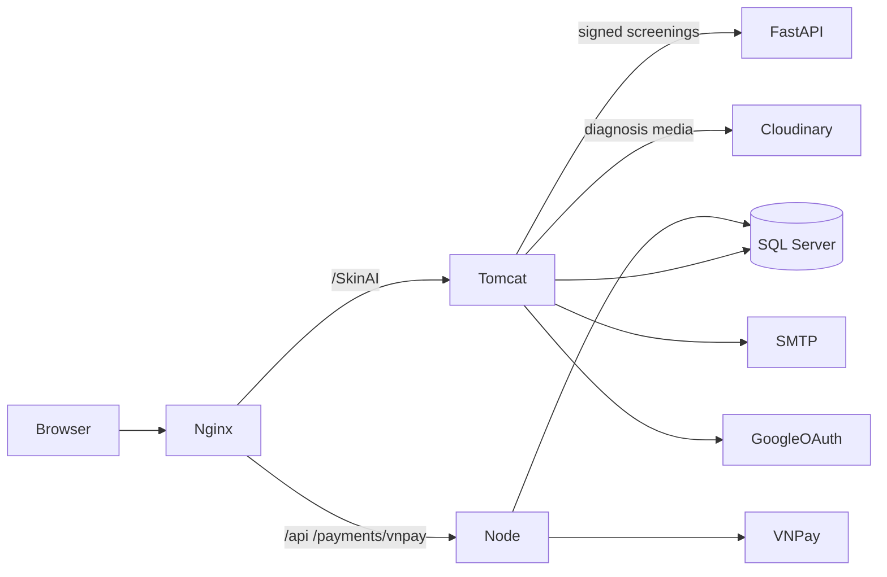
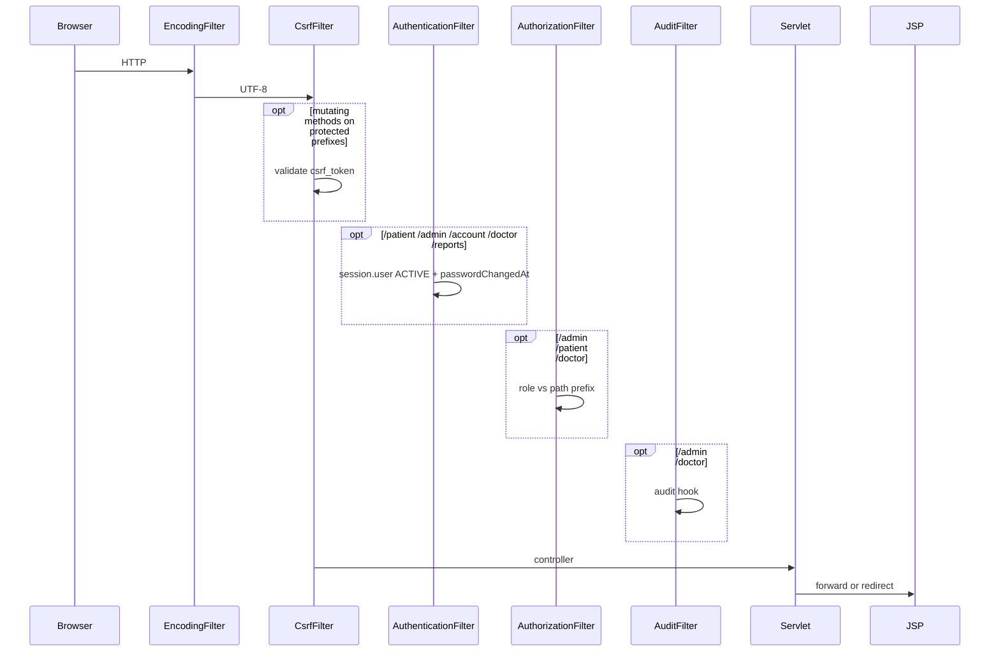
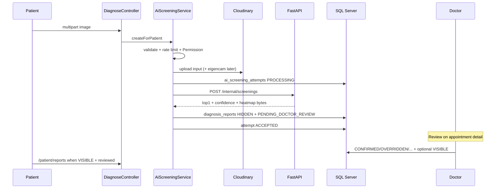

# SkinAI — Architecture

Implementation-driven architecture for the Derma workspace (`SkinAI/`).  
Companion docs: [DESIGN.md](DESIGN.md) · [PRD.md](PRD.md) · [RULES.md](RULES.md) · [SCHEMA.md](SCHEMA.md)

---

## 1. System overview

SkinAI is a multi-process dermatology screening product:

| Process | Tech | Default local |
|---------|------|----------------|
| Web app | Java 17, Jakarta Servlet/JSP, Tomcat 10+ | `http://localhost:9999/SkinAI` |
| AI inference | FastAPI + ONNX (`ai-service/`), uvicorn | `http://127.0.0.1:8000` |
| Payments | Node Express (`payment-service/`) | `http://127.0.0.1:3000` |
| Edge (optional) | Nginx | `:80` → Tomcat + Node |
| Data | SQL Server (`SWP391`) | JDBC via HikariCP |



**Implemented split of billing ownership (ADR-012):** Java creates/reads/cancels invoices; Node owns VNPay URL creation, Return/IPN, payment row writes, and PENDING expiry (via DB stored procedure).

---

## 2. Component responsibilities

| Component | Responsibility |
|-----------|----------------|
| Controllers | HTTP only: parse params, call services/DAOs, set request attrs, forward JSP / redirect |
| Services | Business rules (auth, booking, AI screening, billing invoice ops, medical finalize, notifications) |
| DAOs + `DBContext` | JDBC/HikariCP access; SPs where defined |
| Filters | Encoding, CSRF, authentication, role authorization, admin/doctor audit |
| JSP views | Server-rendered UI by role layouts |
| `ai-service` | Authenticated ONNX inference; no DB/Cloudinary |
| `payment-service` | VNPay HMAC, payment lifecycle, invoice PAID updates |
| Cloudinary | Private diagnosis media + public issue-report uploads |

---

## 3. Module boundaries (Java packages)

```
com.dermathologyai
├── config          AppConfig, AppShutdownListener
├── controller.*    auth | account | admin | doctor | patient | global | ReportMediaController
├── dao             DBContext + entity DAOs
├── service         Auth, OTP, Booking, Billing, AI*, Cloudinary*, Medical, Audit, Notification
├── filter          Encoding, Csrf, Authentication, Authorization, Audit
├── model           Domain entities + PendingRegistration
├── security        Permission enum + PermissionService
├── notification    MailService, templates
└── util            CSRF, validation, GoogleAuth, paging, PDF, mask, format
```

Role URL prefixes: `/auth/*`, `/account/*`, `/admin/*`, `/doctor/*`, `/patient/*`, `/global/*`, `/reports/*` (signed media redirect).

---

## 4. MVC structure

Classic Servlet MVC:

1. `web.xml` maps URL → `HttpServlet`
2. Controller loads session user, validates, delegates
3. Service enforces rules / transactions
4. DAO persists
5. JSP under `WEB-INF/views/{role|auth|account|global|layout}/`

No Spring MVC. No REST JSON API for most product flows (exceptions: admin/doctor dashboard chart endpoints, Node payment API).

---

## 5. Request lifecycle



**Filter order (declaration):** Encoding → Csrf → Authentication → Authorization → Audit.

**Session timeout:** 30 minutes (`web.xml`).

---

## 6. Authentication

| Flow | Entry | Notes |
|------|-------|--------|
| Local login | `/auth/login` | `AuthService.loginLocal`, BCrypt; lock after failures |
| Register + OTP | `/auth/register` → `/auth/verify` | `PendingRegistration` in session (15 min TTL) |
| Google OAuth | `/auth/google` → callback / link | State in session; may require account link |
| Forgot / reset | `/auth/forgot-password` → `/auth/reset-password` | Hashed OTP, purpose `RESET_PASSWORD` |
| Unlock | `/auth/unlock-account` | Purpose `UNLOCK_ACCOUNT` |
| Profile security | `/account/profile` + verify-old / input-new / verify-new | Email/password change via email OTP |
| Logout | `/auth/logout` | POST + CSRF |

**Post-login redirect (`AuthRedirect`):** ADMIN → `/admin/dashboard`; DOCTOR → `/doctor/dashboard`; else `redirectAfterLogin` or `/home`.

**User statuses:** `ACTIVE` | `INACTIVE` | `LOCKED`. Only `ACTIVE` passes AuthenticationFilter.

---

## 7. Authorization

| Layer | Mechanism |
|-------|-----------|
| Route | `AuthorizationFilter`: `/admin`→ADMIN; `/doctor`→DOCTOR; `/patient`→PATIENT\|USER\|ADMIN |
| Capability | `PermissionService` + `Permission` for AI screening create/review/media/config (used by screening services & `ReportMediaController`) |

Admin pages rely primarily on route AuthZ (filters). Extra Permission gates are for AI/media paths, not every admin CRUD page.

---

## 8. AI pipeline



- Java never runs ONNX; FastAPI loads active package under `AI_MODELS_ROOT`.
- Confidence stored as **0–100** percent after normalize (`FormatUtil.confidencePercent`).
- Recovery job: stuck `PROCESSING` attempts + orphan media cleanup (`AiScreeningRecoveryService`).

---

## 9. Java ↔ FastAPI

- Client: `AiInferenceClient`
- Endpoint: `{ai.service.base.url}/internal/screenings`
- Headers: `X-AI-Service-Key`, `X-AI-Request-Nonce`, `X-AI-Request-Timestamp`
- Enabled only when `ai.service.enabled=true` and required secrets present
- Package activate/deactivate: FastAPI `POST /internal/packages/invalidate`

---

## 10. Cloudinary

| Use | Class | Type |
|-----|-------|------|
| Screening input + EigenCAM | `CloudinaryDiagnosisMediaStorage` | Authenticated private |
| Delivery | `CloudinarySignHelper` + `/reports/*` | Time-limited signed URLs |
| Issue report attachments | `CloudinaryUpload` | Public `secure_url` |

Object keys HMAC’d with `media.object.key.secret`. Prefixes: `media.diagnosis.prefix`, `media.issue.prefix`.

---

## 11. Database interaction

- Pool: HikariCP in `DBContext`
- Config: `db.url` / `db.username` / `db.password` via `AppConfig`
- Schema: baseline scripts under `src/main/resources/database/` — see [SCHEMA.md](SCHEMA.md)
- Expire PENDING payments: `usp_expire_pending_payments` (invoked by Node health path, not Java listener)

---

## 12. Configuration

`AppConfig` resolution order:

1. JVM system property  
2. Environment variable (`DOTTED_KEY` → `DOTTED_KEY` with `_`)  
3. `SkinAI/local.properties` (gitignored)  
4. `application.properties` (safe defaults)

AI secrets also in `ai-service/.env.local`. Payment secrets in `payment-service/.env.local`.

---

## 13. External services

| Service | Purpose |
|---------|---------|
| Google OAuth | Login / link |
| SMTP (`MailService`) | OTP, alerts, issue-report status mail |
| Cloudinary | Media |
| FastAPI | Inference |
| VNPay via Node | Online payment |
| Nginx (optional) | Single origin for UI + payment API |

---

## 14. Error handling

- Auth: flash messages in session / request attributes; redirect back to forms
- CSRF fail: HTTP 403 `Invalid or missing CSRF token`
- AI: `ScreeningException` codes (storage/DB/rate/disabled); attempt → `FAILED`/`REJECTED`
- Payment: Node returns gateway errors; Java payment page is auth shell only
- Filters fail closed for inactive users and missing CSRF on mutating requests

---

## 15. Scheduled jobs (`AppShutdownListener`)

| Job | When | Action |
|-----|------|--------|
| AI recovery | `ai.service.enabled` | `recoverStuckAttempts` every `ai.recovery.interval.minutes` (default 5) |
| Notification drain | Always | `drainPendingEmails(20)` every `notification.drain.interval.minutes` (default 1) |

**Not in Java:** payment expiry (Node).

---

## 16. Dependency relationships (runtime)

```
Browser → Tomcat servlets → Services → DAOs → SQL Server
                ↘ AiInferenceClient → FastAPI → ONNX package on disk
                ↘ Cloudinary SDK
                ↘ MailService → SMTP
                ↘ Browser form → Node → VNPay → SQL Server
```

Shared model root: `AI_MODELS_ROOT` must match between Java and FastAPI.

---

## 17. Discrepancies vs older docs

Older `Docs/CODEBASE_MAP.md` / pre-ADR-012 billing notes claimed Java IPN and clinic-fallback / standalone doctor screening queue controllers. **Those are not present.** Current SoT is this file + [RULES.md](RULES.md) ADR summary.
