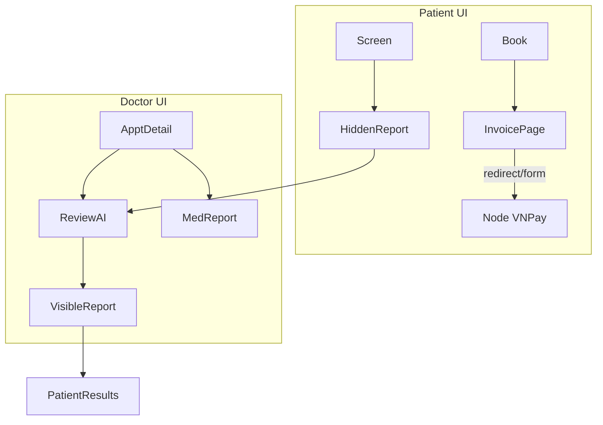

# SkinAI — Design

Why the UI and workflows are structured the way they are.  
Companion: [ARCHITECTURE.md](ARCHITECTURE.md) · [PRD.md](PRD.md) · [SCHEMA.md](SCHEMA.md)

---

## 1. Design principles

| Principle | Implementation signal |
|-----------|------------------------|
| Server-first | JSP + session; minimal SPA |
| Role chrome | Separate headers/nav per role; shared profile shell |
| Screening ≠ diagnosis | Patient nav: **“Kết quả sàng lọc”**; clinical confirm is doctor-owned |
| Fail closed | CSRF, auth filters, AI permissions before media |
| Thin UI | Controllers forward; CSS/JS enhance, don’t own business rules |
| Bento profile | Dense info cards on one page; no preferences / quick-action clutter |

---

## 2. UI architecture

```
webapp/
├── assets/{css,js,img}/     Public static
├── WEB-INF/views/
│   ├── layout/              Shared chrome (headers, footers)
│   ├── auth/                Login, register, OTP, Google link
│   ├── account/             Profile (role-aware)
│   ├── global/              Public home / clinic discovery
│   ├── patient/             Booking, AI, reports, invoices, feedback
│   ├── doctor/              Queue, appointments, medical finalize
│   └── admin/               Users, clinics, AI models, issue reports, KPIs
```

**Layouts:** role-specific header JSP includes + page body. Not a component framework.

---

## 3. Layout system

| Role | Header | Visual cue |
|------|--------|------------|
| Guest / shared | `global-header` | Green accent + role badge when logged in |
| Doctor | `doctor-header` | Blue gradient logo / role |
| Admin | `admin-header` | Black gradient logo / role |
| Patient flows | Patient nav under global/patient chrome | Screening wording, not “chẩn đoán” |

Shared **account profile** (`profile.jsp` + `profile.css`): Bento grid — identity, security, family (patients), role information (doctor/admin). Preferences and Quick Actions removed intentionally.

---

## 4. Shared components

- Flash / alert message patterns via session or request attributes
- CSRF hidden fields on mutating forms (`CsrfUtil`)
- Pagination helpers (`PagingUtil`)
- Cloudinary-backed image display for reports (signed redirect via `/reports/*`)
- Chart endpoints for admin/doctor dashboards (JSON consumed by page JS)

No shared React/Vue component library. Reuse = JSP includes + CSS classes.

---

## 5. Navigation (role-based UX)

| Role | Primary destinations |
|------|----------------------|
| Guest | Home, clinic browse, login/register |
| PATIENT / USER | Book, AI screening, screening results, invoices, feedback, profile, issue report |
| DOCTOR | Dashboard, appointment queue, appointment detail (incl. AI review), medical reports |
| ADMIN | Dashboard, users, clinics, doctors, AI models/policy, issue reports, feedback moderation |

Authorization is path-prefix based; UI simply hides links the filters would reject.

---

## 6. Responsive strategy

- Mobile-friendly CSS on profile/booking/admin tables (media queries in role CSS)
- No separate mobile app; progressive layout collapse
- Forms remain full-page posts (file upload, OTP) — reliable over fragile SPA upload flows

---

## 7. Workflows (by role)

### 7.1 AI screening (patient → doctor)

1. Patient uploads image on diagnose page  
2. System stores private media, calls FastAPI, writes attempt + HIDDEN report  
3. Doctor reviews on **appointment detail** (not a standalone screening queue page)  
4. On confirm/override, report may become VISIBLE; patient sees under screening results  
5. Unshared reviewed reports: patient gets 403 / limited view rules for pending only  

**Why:** Keeps clinical review in the appointment context (billing + schedule already there).

### 7.2 Admin

- CRUD users/clinics/doctors; activate AI packages; clinical policy  
- Issue reports: description + optional Cloudinary image; status emails  
- Dashboards: aggregate KPIs from services/DAOs  

### 7.3 User / Patient

- Register → OTP → ACTIVE  
- Book appointment → invoice → pay via Node/VNPay shell page  
- Screen skin → wait doctor visibility  
- Rate completed visits; submit issue reports  

### 7.4 Doctor

- See queue/dashboard  
- Open appointment: triage AI, write prescription/lab notes, finalize medical report  
- Finalize also drives appointment toward COMPLETED for patient rating eligibility  

### 7.5 Guest

- Marketing/home + clinic discovery without PHI  

---

## 8. Data flow (UI-relevant)



State that matters to UX lives in DB enums (`appointments.status`, `diagnosis_reports.visibility` / review status, `invoices`/`payments` status). Session holds auth + CSRF + pending registration only.

---

## 9. State transitions (product-facing)

| Domain | Key states (implemented) |
|--------|---------------------------|
| User | INACTIVE → ACTIVE (OTP); ACTIVE ↔ LOCKED |
| Appointment | booked → in progress / completed / cancelled (exact labels in SCHEMA) |
| AI attempt | PROCESSING → ACCEPTED / FAILED / REJECTED |
| Diagnosis report | PENDING_DOCTOR_REVIEW → CONFIRMED/OVERRIDDEN/…; HIDDEN → VISIBLE |
| Invoice | created → paid/cancelled; payment PENDING → SUCCESS/EXPIRED via Node |

---

## 10. Validation strategy

| Boundary | Approach |
|----------|----------|
| Forms | Server-side in controllers/services; util validators |
| CSRF | Filter on mutating methods for protected prefixes |
| Uploads | Size/type checks in AI + issue-report paths |
| OTP | Hashed tokens, purpose-scoped, TTL |
| AI | Permission + rate limit + service enabled flag |

Client JS is convenience only; never trust-only.

---

## 11. Security design (UX implications)

- No diagnosis images on public CDN without signed delivery  
- Patient cannot see doctor-pending internals beyond limited pending view  
- Admin/doctor actions audited  
- Password change forces re-proof via OTP flows on profile  

Details: [ARCHITECTURE.md](ARCHITECTURE.md) §5–7, [RULES.md](RULES.md) Security.

---

## 12. File organization rationale

| Choice | Why |
|--------|-----|
| Controllers by role package | Matches URL prefixes and AuthZ mental model |
| Services not split by “microservice” | One WAR; billing payment half is separate Node process by ADR |
| Views mirror roles | Designers/devs find pages by actor |
| `ai-service` / `payment-service` siblings | Different runtimes; keep secrets and deploys isolated |
| Baseline SQL folders | Schema SoT for student/local rebuild; no Flyway-style app migrations in day-to-day |

---

## 13. Out of design scope (not implemented)

- Design system / Storybook  
- Dark mode product theme  
- Native mobile clients  
- Real-time WebSocket queue boards  

Mark any future UI as planned in [PRD.md](PRD.md), not here.
