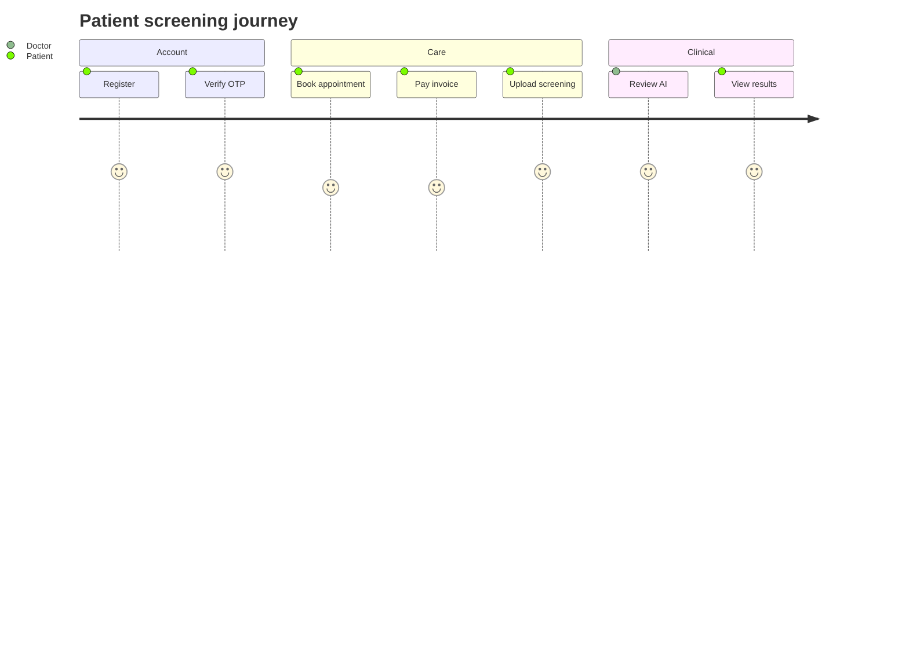

# SkinAI — Product Requirements (reverse-engineered)

Requirements inferred from **implemented** code and schema.  
Not a wishlist. Planned gaps are called out explicitly.  
Companion: [ARCHITECTURE.md](ARCHITECTURE.md) · [DESIGN.md](DESIGN.md) · [SCHEMA.md](SCHEMA.md)

---

## 1. Vision

Help patients get accessible **AI-assisted skin screening**, book clinic care, and let doctors **confirm or override** AI findings inside appointment workflows — with admin ops, issue reporting, and VNPay billing.

---

## 2. Objectives

| # | Objective | Evidence |
|---|-----------|----------|
| O1 | Authenticated multi-role clinic web app | Auth filters + role packages |
| O2 | AI screening with doctor review gate | `AiScreeningService` + diagnosis reports |
| O3 | Appointment booking + medical documentation | Booking/medical services + tables |
| O4 | Online payment for invoices | Node VNPay + Java invoices |
| O5 | Admin governance (users, clinics, AI, issues) | `/admin/*` controllers |
| O6 | Notifications via email | `MailService` + notification drain |

---

## 3. User roles

| Role (DB) | Who | Capabilities (implemented) |
|-----------|-----|----------------------------|
| USER | Registered account not fully patient-profiled | Same patient route AuthZ as PATIENT for `/patient` |
| PATIENT | Care seeker | Book, screen, pay, feedback, issues, profile/family |
| DOCTOR | Clinician | Dashboard, appointments, AI review, medical finalize |
| ADMIN | Operator | Users, clinics, AI models/policy, issues, KPIs |

Guest: public home/clinic browse without login.

---

## 4. Functional requirements

### 4.1 Authentication — **Implemented**

- FR-A1 Local login / logout (CSRF on logout)
- FR-A2 Register with email OTP verification
- FR-A3 Google OAuth login and account linking
- FR-A4 Forgot password / reset via OTP
- FR-A5 Unlock locked account via OTP
- FR-A6 Profile email/password change with OTP steps
- FR-A7 Session timeout 30 minutes; ACTIVE-only access

### 4.2 Administration — **Implemented**

- FR-AD1 User list/detail/status management
- FR-AD2 Clinic / doctor management
- FR-AD3 AI model package activate/deactivate (+ FastAPI invalidate)
- FR-AD4 Clinical policy entries for screening guidance
- FR-AD5 Issue report triage + status email
- FR-AD6 Feedback moderation surfaces
- FR-AD7 Admin dashboard KPIs / charts

### 4.3 Patient / user journeys — **Implemented**

- FR-P1 Discover clinics / home content
- FR-P2 Book appointments (slots/doctors/clinics)
- FR-P3 View invoices; initiate payment via payment UI → Node
- FR-P4 Submit AI screening images; view results when policy allows
- FR-P5 Family member records on profile (patients)
- FR-P6 Feedback / rating when appointment or medical report completed
- FR-P7 Submit issue reports (description + optional image)

### 4.4 Doctor — **Implemented**

- FR-D1 Doctor dashboard
- FR-D2 Appointment queue / detail
- FR-D3 Review AI screening on appointment detail
- FR-D4 Prescriptions / lab tests / medical report finalize
- FR-D5 Completing medical report contributes to COMPLETED appointment state for rating

### 4.5 AI screening — **Implemented**

- FR-AI1 Multipart upload → private Cloudinary storage
- FR-AI2 Call FastAPI ONNX screening
- FR-AI3 Persist attempt + diagnosis report (hidden until reviewed/shared)
- FR-AI4 Rate limits / permissions / service kill-switch
- FR-AI5 Recovery of stuck PROCESSING attempts
- FR-AI6 Signed media delivery for authorized viewers

### 4.6 Billing — **Implemented (split)**

- FR-B1 Java: create/read/cancel invoices
- FR-B2 Node: VNPay create payment URL, Return, IPN, expire PENDING
- FR-B3 Shared SQL invoices/payments tables

### 4.7 Reporting / analytics — **Implemented (limited)**

- FR-R1 Admin/doctor dashboard aggregates and chart endpoints
- FR-R2 Medical reports as clinical documents (not BI warehouse)

### 4.8 Not found / out of scope (do not treat as shipped)

- Native mobile apps
- Insurance gateway / LIS / PACS
- Real-time WebSocket triage boards
- Standalone doctor “AI queue” module separate from appointments
- Java-owned VNPay IPN (removed; ADR-012)
- Soft-delete product-wide archive UI
- Multi-tenant SaaS billing

---

## 5. Non-functional requirements

| ID | Requirement | How met |
|----|-------------|---------|
| NFR-1 | Secrets out of git | `local.properties`, `.env.local` gitignored |
| NFR-2 | CSRF on mutating protected routes | `CsrfFilter` |
| NFR-3 | Least privilege on media | Private Cloudinary + signed URLs + PermissionService |
| NFR-4 | AI trust boundary | Inference key + nonce/timestamp; Java owns persistence |
| NFR-5 | Baseline-rebuildable DB | SQL scripts under `database/` |
| NFR-6 | Session auth | HttpSession + filters |
| NFR-7 | Email delivery resilience | Notification queue + drain job |

---

## 6. Business rules (selected)

1. Only ACTIVE users pass AuthenticationFilter.  
2. AI results are screening aids; doctor confirmation/override before patient-visible clinical framing.  
3. Diagnosis media is authenticated; issue-report images may be public CDN URLs.  
4. Invoice creation is Java; money movement is Node/VNPay.  
5. Patient rating allowed if appointment **or** medical report is completed.  
6. Pending registration lives in session (~15 min), not DB.  
7. Account lock after repeated failed logins; unlock via OTP.  
8. `appointments.slot_id` may exist without FK (see SCHEMA).  

---

## 7. User journeys (happy paths)

### 7.1 Register → screen → review

### 7.2 Pay invoice

Patient opens invoice → payment page (Java shell) → Node creates VNPay URL → bank → IPN/Return updates payment + invoice PAID.

### 7.3 Admin activates AI package

Admin uploads/activates package metadata → disk under `AI_MODELS_ROOT` → invalidate FastAPI cache → new screenings use package.

---

## 8. Constraints

- Tomcat WAR + separate Node and FastAPI processes (ops complexity)
- SQL Server required
- Cloudinary account required for diagnosis media in production-like runs
- VNPay sandbox/prod credentials for payments
- Student/course timeline: YAGNI and baseline schema (no migration-churn)

---

## 9. Future ideas (not requirements)

Document only so they are **not** confused with shipped scope:

- Unified API gateway / BFF
- Push notifications / SMS OTP
- Soft delete + GDPR export packs
- Dedicated doctor AI worklist independent of appointments
- Automated CI schema drift checks

---

## 10. Success criteria (product)

A release is “complete” for a vertical when:

1. Role can finish its journey without dead links  
2. Filters reject wrong roles  
3. AI path fails closed when disabled/misconfigured  
4. Docs in `Docs/` match behavior (this file included)
