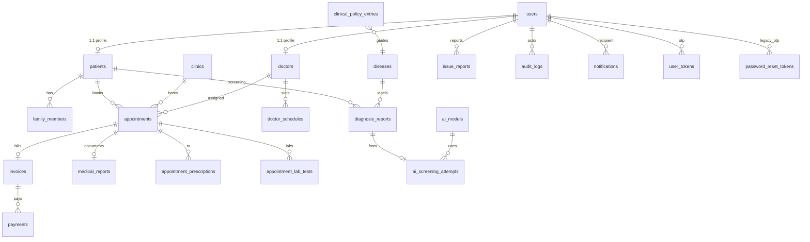
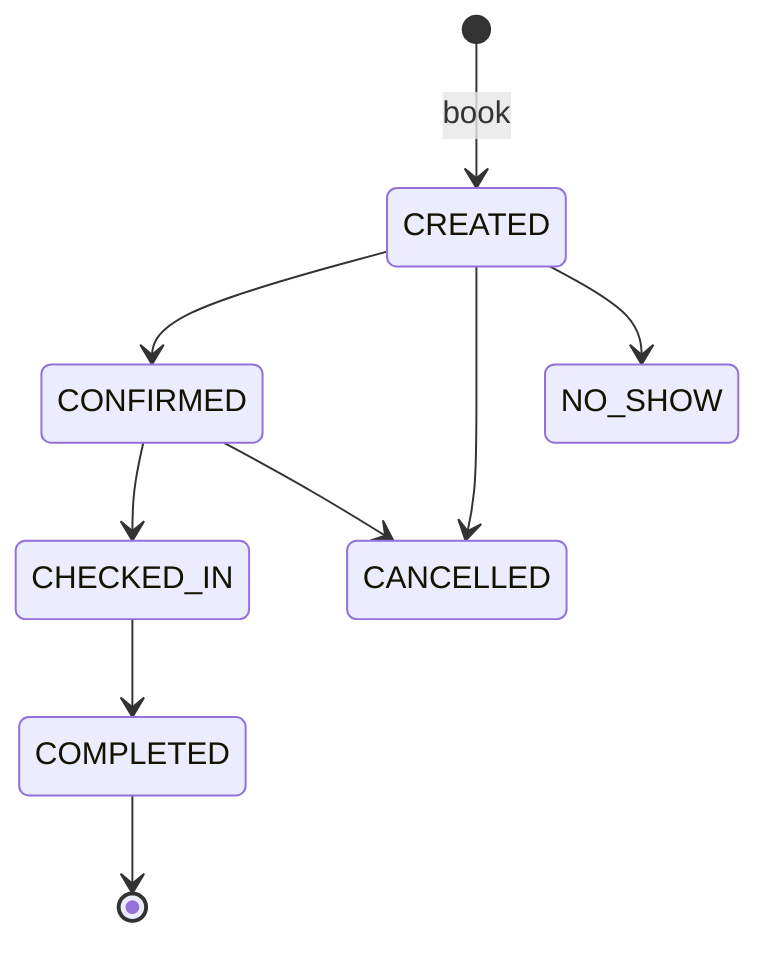
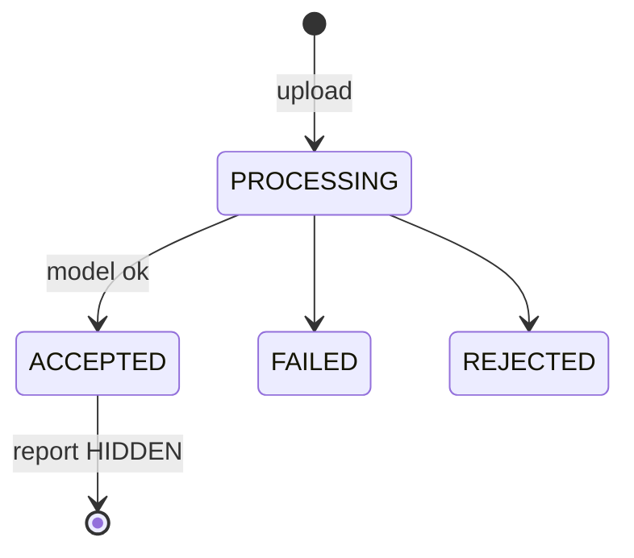
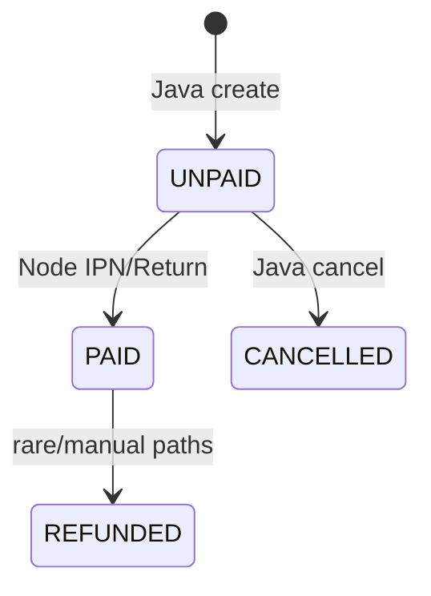

# DermAI — Database Schema

Implementation SoT: baseline scripts under  
`DermAI/src/main/resources/database/` (`02_Tables`, `03_Constraints`, SPs, seeds, `Master_Deploy.sql`, `WipeData.sql`).  
Deploy ops detail: `DermAI/src/main/resources/database/docs/`.  
Companion: [ARCHITECTURE.md](ARCHITECTURE.md) · [RULES.md](RULES.md) · [API_REFERENCE.md](API_REFERENCE.md)

**Policy:** baseline-first — edit scripts in place; do not add new `08_Migrations/V*.sql` for normal development. Existing `08_Migrations/*` are historical leftovers.

---

## 1. ER overview

25 baseline tables in `02_Tables/dbo/` (plus any legacy-only artifacts in historical migrations — prefer baseline).

---

## 2. Table catalog

| Table | Responsibility |
|-------|----------------|
| `users` | Auth identity, role, status, lock, Google link |
| `patients` | Patient demographics linked to `users` |
| `doctors` | Clinician profile linked to `users` + clinic |
| `clinics` | Facilities (CLINIC/HOSPITAL), geo, fees context |
| `doctor_schedules` | Morning/Afternoon/Evening availability |
| `appointments` | Booking lifecycle + doctor/attendance status |
| `appointment_prescriptions` | Rx lines for an appointment |
| `appointment_lab_tests` | Lab orders for an appointment |
| `family_members` | Dependents bookable under a patient |
| `diseases` | Disease catalog for AI/doctor labels |
| `diagnosis_reports` | AI (+ doctor review) screening report |
| `ai_screening_attempts` | Idempotent screening job ledger |
| `ai_models` | Installed ONNX package metadata (`is_active`) |
| `clinical_policy_entries` | Risk/guidance policy per disease |
| `invoices` | One invoice per appointment (Java-owned) |
| `payments` | VNPay/CASH attempts (Node writes VNPay) |
| `medical_reports` | Doctor clinical note (1 per appointment) |
| `feedbacks` | Patient ratings/comments |
| `issue_reports` | Support tickets (`description`, optional `image_url`) |
| `notifications` | Email outbox |
| `notification_job_settings` | Drain job knobs |
| `password_reset_tokens` | Older OTP store (purpose-scoped) |
| `user_tokens` | Newer token store (OTP/session-ish) |
| `audit_logs` | Admin/doctor audit trail |
| `account_appeals` | Unlock appeals workflow |

---

## 3. Core entity details

### 3.1 User model — `users`

| Column | Notes |
|--------|--------|
| `id` | UUID PK |
| `email` / `google_id` | At least one required (`CHK_users_identity`) |
| `pending_email` | Email-change staging |
| `username`, `full_name`, `password_hash`, `avatar`, `phone` | Profile/auth |
| `role` | `USER` \| `PATIENT` \| `DOCTOR` \| `ADMIN` |
| `status` | `ACTIVE` \| `INACTIVE` \| `LOCKED` |
| Lock fields | `failed_login_attempts`, `lock_type`, `lock_reason`, `locked_at`, `locked_by` |
| `password_changed_at` | Session invalidation signal |

**App use:** Session principal; filters require `ACTIVE`.

### 3.2 Patient / doctor / clinic

- `patients` / `doctors`: extend `users` (1:1 unique doctor-user).  
- `clinics`: facility + location; appointments and doctors attach here.  
- `doctor_schedules`: `slot` ∈ `MORNING` \| `AFTERNOON` \| `EVENING`.

### 3.3 Appointment model — `appointments`

| Column | Notes |
|--------|--------|
| `request_id` | Unique client/idempotency style id |
| `patient_id`, `clinic_id`, `doctor_id` | Parties |
| `diagnosis_report_id` | Optional link to screening |
| `appointment_time`, `notes` | When / free text |
| Snapshot fields | `patient_name`, `patient_dob`, `patient_gender` |
| `status` | `CREATED` \| `CONFIRMED` \| `CHECKED_IN` \| `COMPLETED` \| `CANCELLED` \| `NO_SHOW` |
| `doctor_status` | `PENDING` \| `ACCEPTED` \| `REJECTED` |
| `attendance_status` | `NOT_VISITED` \| `VISITED` \| `NO_SHOW` \| `CANCELLED` |
| `family_member_id` | Optional dependent |
| `slot_id` | Indexed; **no FK** (intentional gap) |

**App use:** BookingService; doctor queue/detail; invoice creation; rating eligibility with medical report.

### 3.4 AI-related data

**`ai_screening_attempts`**

| Status | Meaning |
|--------|---------|
| `PENDING` / `PROCESSING` | In flight |
| `ACCEPTED` | Model result accepted → report |
| `REJECTED` / `FAILED` | Terminal failure |

Unique `idempotency_key`; links `ai_model_id`, optional `diagnosis_report_id`, Cloudinary object keys, SHA-256 of input.

**`diagnosis_reports`**

| Field group | Purpose |
|-------------|---------|
| Media | Legacy `image_url`/`heatmap_url` + `*_object_key` |
| AI output | `confidence_score` 0–100, `risk_level`, `recommendation`, `model_version` |
| Review | `doctor_review_status`, reviewer, override disease/reason, notes |
| Visibility | `patient_visibility_status` `HIDDEN` \| `VISIBLE` |

Review statuses: `PENDING_DOCTOR_REVIEW` \| `CONFIRMED` \| `OVERRIDDEN` \| `DISMISSED` \| `REQUIRES_IN_PERSON_REVIEW`.

Checks enforce: override requires disease+reason; VISIBLE cannot stay pending review.

**`ai_models`:** package name/version/`storage_path`/`is_active`.  
**`clinical_policy_entries`:** policy text/risk guidance (survives some wipe scenarios).  
**`diseases`:** label catalog.

### 3.5 Payments

**`invoices`:** 1:1 appointment (`UQ_invoices_appointment_id`); status `UNPAID` \| `PAID` \| `CANCELLED` \| `REFUNDED`; `paid_at` required iff PAID.

**`payments`:** amount > 0; method `VNPAY` \| `CASH` \| `BANK_TRANSFER`; status `PENDING` \| `SUCCESS` \| `FAILED` \| `EXPIRED` \| `REFUNDED`; unique `txn_ref`; VNPay callback fields + `signature_verified`. SUCCESS for VNPay requires verified signature and response codes `00`.

**App use:** Java creates/cancels invoices; Node inserts/updates payments and marks invoice PAID; expiry via `usp_expire_pending_payments`.

### 3.6 Medical records

- `medical_reports`: chief complaint, diagnosis, plan; status `DRAFT` \| `COMPLETED` \| `AMENDED`; unique per appointment.  
- `appointment_prescriptions` / `appointment_lab_tests`: child clinical lines.  
- Completing medical report participates in appointment COMPLETED / patient rating rules (app layer).

### 3.7 Feedbacks & issues

- `feedbacks`: rating 1–5; Vietnamese category/status check constraints.  
- `issue_reports`: `report_code` unique; category APPOINTMENT/PAYMENT/ACCOUNT/SYSTEM/OTHER; status PENDING→…; **`description` only** (no `report_detail` column).

### 3.8 Notifications & tokens

- `notifications`: typed outbox + `email_status` PENDING→SENT/FAILED.  
- `notification_job_settings`: drain configuration.  
- `password_reset_tokens` / `user_tokens`: OTP/token storage (purposes include verify/reset/unlock; app may use one or both depending on flow — verify in Auth/OTP services before assuming both are live for every purpose).

### 3.9 Audit & appeals

- `audit_logs`: who/what/when for admin/doctor filter hooks.  
- `account_appeals`: PENDING/APPROVED/REJECTED unlock appeals.

---

## 4. Keys, uniqueness, indexes (highlights)

| Constraint | Table | Meaning |
|------------|-------|---------|
| PK | all entities | `id` UUID |
| UQ username | `users` | login name |
| UQ request_id | `appointments` | booking idempotency |
| UQ patient+time | `appointments` | anti-double-book (as defined) |
| UQ invoice↔appointment | `invoices` | one bill |
| UQ txn_ref | `payments` | payment idempotency |
| UQ medical↔appointment | `medical_reports` | one clinical note |
| UQ attempt idempotency | `ai_screening_attempts` | screening dedupe |
| UQ doctors.user | `doctors` | one doctor profile |
| UQ schedule | `doctor_schedules` | doctor+date+slot |
| UQ issue code | `issue_reports` | human ticket id |
| UQ disease name | `diseases` | catalog |

Full FK scripts: `03_Constraints/05_ForeignKeys/*.sql`.  
AI FKs: `003_AiScreeningForeignKeys.sql`.

---

## 5. Enumerations (CHECK constraints)

See §3 and `03_Constraints/03_CheckConstraints/`. AI-specific: `003_AiScreeningChecks.sql`.

---

## 6. Relationships & referential integrity

- Prefer cascade/restrict as defined in FK scripts (do not invent ON DELETE behavior in docs without reading the SQL).  
- **Gap:** `appointments.slot_id` has no FK — application must tolerate orphan/null slots.  
- Diagnosis report visibility/review checks enforce clinical publish rules at DB layer.

---

## 7. Data lifecycle

**Wipe:** transactional wipe of operational data; confirm whether AI catalog/attempt tables are excluded in current `WipeData.sql` before relying on a clean AI slate.

**Seeds:** demo users/clinics/diseases/models under seed scripts after deploy.

---

## 8. How the app uses the schema (by flow)

| Flow | Tables touched |
|------|----------------|
| Register/login | `users`, tokens |
| Book + pay | `appointments`, `invoices`, `payments` |
| AI screen | `ai_models`, `ai_screening_attempts`, `diagnosis_reports`, `diseases`, policy |
| Doctor visit | `appointments`, prescriptions/labs, `medical_reports`, review columns on `diagnosis_reports` |
| Support | `issue_reports`, `notifications` |
| Admin KPI | aggregates over appointments/users/invoices (read) + `audit_logs` |

---

## 9. Reports

- **Clinical:** `medical_reports` + linked appointment/diagnosis.  
- **Screening:** `diagnosis_reports` (patient-visible only when rules allow).  
- **Ops:** issue reports + dashboard queries (not a separate warehouse).

---

## 10. Discrepancies / pitfalls

| Topic | Reality |
|-------|---------|
| `report_detail` on issues | **Does not exist** — use `description` |
| Soft delete | Not implemented |
| Payment writers | Node for VNPay rows; Java for invoice rows |
| `08_Migrations` | Historical; not the change path |
| Dual token tables | Both exist in baseline — confirm which OTP path a given feature uses in Java before documenting “the” token table as exclusive |

When a column is referenced in old prose but missing from `02_Tables`, treat baseline DDL as truth.
